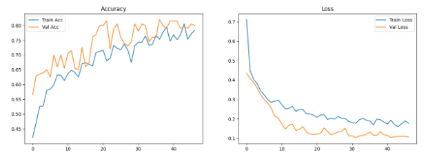
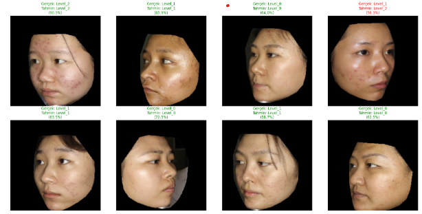

# Vision Transformer (ViT) ile Akne Şiddeti Sınıflandırması

Bu proje, yüz görüntülerinden akne şiddetini otomatik olarak sınıflandırmayı amaçlayan derin öğrenme tabanlı bir çalışmadır. Model olarak güncel **Vision Transformer (ViT)** mimarisi kullanılmış ve sınıf dengesizliği problemleri gelişmiş kayıp fonksiyonları ile aşılmıştır.

---

## Proje İçeriği ve Hızlı Erişim
* **[Ana Kod Dosyası (Notebook)](./vit-acne.ipynb)**: Modelin veri yükleme, eğitim ve test süreçlerini içeren kaynak kodlar.
* **[Proje Sunumu (PDF)](./sunum.pdf)**: Deneylerin ve metodolojinin özetlendiği nihai sunum dosyası.
* **[Gereksinimler](./requirements.txt)**: Projenin çalışması için gerekli kütüphane listesi.
* **[Çıktılar Klasörü](./outputs/)**: Eğitim grafikleri ve karmaşıklık matrisi.

---

## 1. Problemin Tanımı
Akne şiddetinin belirlenmesi klinik teşhis süreçlerinde kritik bir öneme sahiptir. Bu proje, akne seviyelerini üç ana sınıfta (**Level_0, Level_1, Level_2**) sınıflandırarak uzmanlara karar destek sistemi sağlamayı hedeflemektedir. Veri setindeki sınıflar arası sayısal dengesizlik (özellikle Level_2 sınıfının azlığı), modelin öğrenme sürecinde karşılaşılan temel zorluktur.

---

## 2. Veri Seti ve Ön İşleme
* **Veri Seti:** Kaggle Acne Grading Dataset.
* **Sınıf Dağılımı:**
    * **Level_0 (Hafif):** %38.7
    * **Level_1 (Orta):** %47.3
    * **Level_2 (Şiddetli):** %13.9
* **Ön İşleme Adımları:**
    * Görüntüler **224x224** boyutuna ölçeklendirilmiş ve **1/255** oranında normalize edilmiştir.
    * **Mixup Augmentation** ve kapsamlı veri artırma teknikleri uygulanmıştır.

---

## 3. Model Mimarisi ve Yaklaşım
* **Mimari:** ImageNet-21k üzerinde ön eğitim almış **ViT-Base (Vision Transformer)**.
* **Gerekçe:** Geleneksel CNN yapılarının aksine, ViT mimarisi **Self-Attention (Öz-dikkat)** mekanizması sayesinde görüntüdeki dokusal özellikler arasındaki uzun menzilli ilişkileri daha iyi analiz edebilmektedir.

* **Kayıp Fonksiyonu:** Sınıf dengesizliğini gidermek için **Balanced Focal Loss** (gamma=2.5) kullanılmıştır. Azınlık sınıf olan Level_2'ye **3.60 kat** daha fazla ağırlık verilmiştir.

---

## 4. Model Performansı (Nicel Metrikler)
Eğitim sonucunda elde edilen başarı metrikleri şöyledir:

| Metrik | Değer |
| :--- | :--- |
| **Doğruluk (Accuracy)** | %81 |
| **Level_2 Duyarlılığı (Recall)** | %93 |
| **F1-Skoru (Makro)** | %82 |

### Eğitim Süreci ve Hata Analizi
Modelin eğitim/doğrulama sürecindeki başarısını ve sınıf bazlı tahmin performansını aşağıdaki grafiklerden inceleyebilirsiniz:




---

## 5. Örnek Inference Görselleri
Modelin test verisi üzerindeki örnek tahminleri:



---

## 6. Çalıştırma Talimatları
Proje, GPU destekli bir Python ortamında çalıştırılmalıdır.

1.  **Bağımlılıkları Yükleyin:**
    ```bash
    pip install -r requirements.txt
    ```
2.  **Veri Setini Hazırlayın:** * Veri setini [Kaggle Acne Grading Dataset](https://www.kaggle.com/datasets/rutviklathiyateksun/acne-grading-classificationdataset) adresinden indirin.
    * Veri seti klasörünü projenin ana dizinine yerleştirin.
    * Eğer yerel ortamda çalıştırıyorsanız, `vit-acne.ipynb` içindeki `BASE_PATH` değişkenini veri setini indirdiğiniz klasör yoluna göre güncelleyin.
3.  **Modeli Çalıştırın:**
    Jupyter Notebook üzerinden `vit-acne.ipynb` dosyasını açarak tüm hücreleri sırasıyla çalıştırın.

---

### ⚠️ Not
Bu reponun içeriği ve anlatılan deneyler, sunulan **[sunum.pdf](./sunum.pdf)** dosyasıyla örtüşmektedir.
